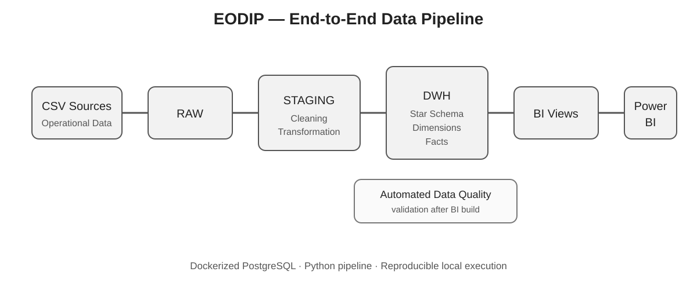
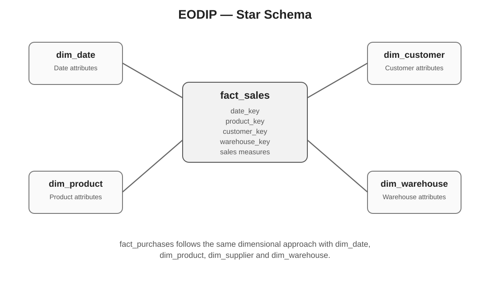
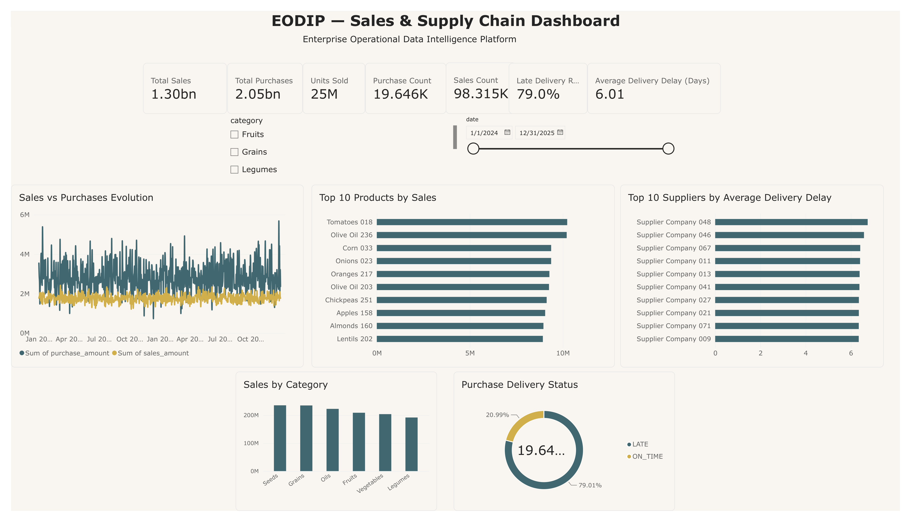

# EODIP — Enterprise Operational Data Intelligence Platform

### End-to-End Data Engineering Platform for Supply Chain, Procurement, Sales & Decision Intelligence

EODIP is an end-to-end **Data Engineering and Business Intelligence platform** designed to transform operational CSV data into structured, validated and analytics-ready datasets for decision-making.

The platform implements the following workflow:

```text
CSV Sources
    ↓
RAW
    ↓
STAGING
    ↓
DATA WAREHOUSE
    ↓
BI VIEWS
    ↓
POWER BI
```

## Project Overview

EODIP focuses on building a reliable analytical data platform covering:

- Sales
- Procurement
- Suppliers
- Products
- Customers
- Warehouses

The project demonstrates practical skills in **data ingestion, transformation, data quality, dimensional modeling, data warehousing, pipeline automation and Business Intelligence**.

## Architecture



### Data flow

```text
RAW → STAGING → DWH → BI → Power BI
```

## Data Warehouse

The analytical model follows a **Star Schema** with:

### Dimensions

```text
dim_date
dim_product
dim_customer
dim_supplier
dim_warehouse
```

### Fact tables

```text
fact_sales
fact_purchases
```



The model separates reusable business dimensions from transactional facts to support analytical queries and reporting.

## Data Engineering Pipeline

The complete pipeline is orchestrated through a single Python entry point:

```bash
python run_pipeline.py
```

Execution flow:

```text
1. Data ingestion
       ↓
2. RAW → STAGING
       ↓
3. STAGING → DWH
       ↓
4. DWH → BI
       ↓
5. Data Quality Validation
```

The orchestrator executes the ingestion, staging, warehouse, BI and validation steps in sequence.

A successful end-to-end run ends with:

```text
EODIP PIPELINE COMPLETED SUCCESSFULLY
```

## Data Quality

EODIP includes automated validation checks covering:

- Required table availability
- Critical NULL values
- Referential integrity
- Fact-to-dimension relationships
- BI view availability
- Presence of analytical data

Key relationships validated include:

```text
Sales
 ├── Date
 ├── Product
 ├── Customer
 └── Warehouse

Purchases
 ├── Date
 ├── Product
 ├── Supplier
 └── Warehouse
```

Run validation independently with:

```bash
python src/validation/validate_pipeline.py
```

Successful validation ends with:

```text
EODIP VALIDATION COMPLETED SUCCESSFULLY
```

## Business Intelligence

The BI layer exposes business-oriented PostgreSQL views:

```text
bi.vw_sales_performance
bi.vw_purchase_performance
bi.vw_supply_chain_performance
```

These views provide the analytical foundation for Power BI.

## Power BI Dashboard

### EODIP — Sales & Supply Chain Dashboard

The dashboard provides decision-oriented analysis of sales, procurement and supplier delivery performance.



### Key indicators

- Total Sales
- Total Purchases
- Units Sold
- Sales Count
- Purchase Count
- Late Delivery Rate
- Average Delivery Delay

### Main analyses

- Sales vs Purchases Evolution
- Sales by Category
- Top 10 Products by Sales
- Top 10 Suppliers by Average Delivery Delay
- Purchase Delivery Status

### Filters

- Date
- Category

The Power BI report is available in:

```text
powerbi/EODIP_Sales_SupplyChain_Dashboard.pbix
```

## Technology Stack

| Area | Technologies |
|---|---|
| Programming | Python |
| Data Processing | Pandas · NumPy |
| Database | PostgreSQL |
| Data Engineering | ETL/ELT · Data Pipelines |
| Data Warehouse | Star Schema |
| Business Intelligence | Power BI · DAX |
| Data Quality | Automated Validation |
| Containerization | Docker · Docker Compose |
| Database Access | Psycopg / SQLAlchemy |
| Version Control | Git · GitHub |

## Project Structure

```text
enterprise-operational-data-intelligence-platform/
│
├── data/
├── docker/
├── docs/
│   ├── architecture/
│   ├── business/
│   └── images/
├── notebooks/
├── powerbi/
├── sql/
│   └── bi/
├── src/
│   ├── data_generation/
│   ├── ingestion/
│   ├── quality/
│   ├── transformation/
│   ├── warehouse/
│   ├── bi/
│   └── validation/
├── tests/
├── docker-compose.yml
├── .env.example
├── requirements.txt
├── run_pipeline.py
└── README.md
```

## Configuration

Create a local `.env` file from `.env.example`.

For the Docker environment:

```env
DB_HOST=localhost
DB_PORT=5433
DB_NAME=postgres
DB_USER=postgres
DB_PASSWORD=postgres
```

The repository includes `.env` in `.gitignore`; local credentials should not be committed.

## Installation

### 1. Clone the repository

```bash
git clone https://github.com/MedByteSystems/enterprise-operational-data-intelligence-platform.git
cd enterprise-operational-data-intelligence-platform
```

### 2. Create the Python virtual environment

```bash
python -m venv .venv
```

Git Bash:

```bash
source .venv/Scripts/activate
```

### 3. Install dependencies

```bash
pip install -r requirements.txt
```

### 4. Configure environment variables

Create `.env` from `.env.example`.

### 5. Start PostgreSQL

```bash
docker compose up -d
```

The container maps:

```text
localhost:5433 → PostgreSQL:5432
```

### 6. Run the complete pipeline

```bash
python run_pipeline.py
```

### 7. Stop the environment

```bash
docker compose down
```

## Scope & Limitation

The current implementation focuses on:

- Sales
- Procurement
- Products
- Suppliers
- Customers
- Warehouses

A dedicated `fact_inventory` table is **not implemented** because the available source data does not provide a dedicated inventory or stock-movement dataset.

Inventory metrics are therefore not artificially generated.

## Future Improvements

Potential extensions include:

- Workflow orchestration with Airflow, Prefect or Dagster
- Incremental data loading
- Pipeline scheduling
- Monitoring and alerting
- CI/CD
- Cloud deployment
- Cloud Data Warehouse integration
- Streaming and near-real-time ingestion
- Advanced predictive analytics

These extensions are outside the current project scope.

## Key Skills Demonstrated

**Python · SQL · PostgreSQL · ETL · Data Pipelines · Data Quality · Data Warehouse · Star Schema · Docker · Power BI · DAX · Git/GitHub**
